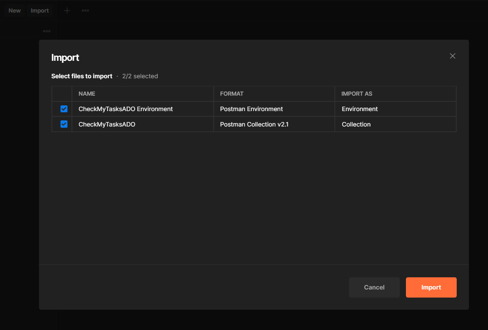
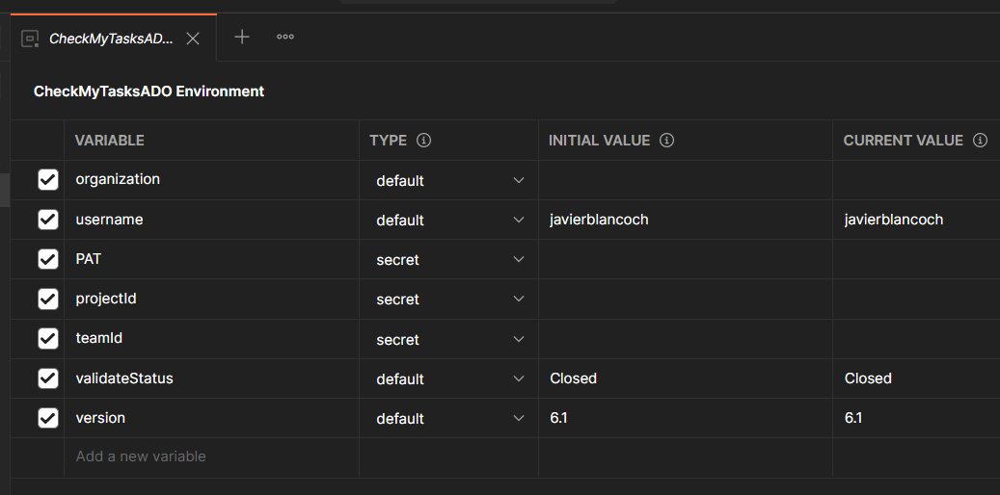
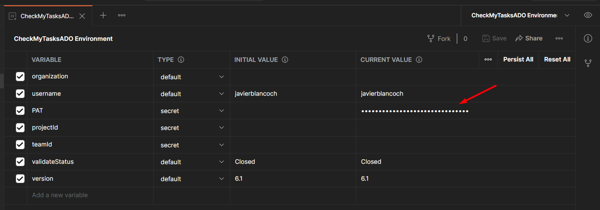
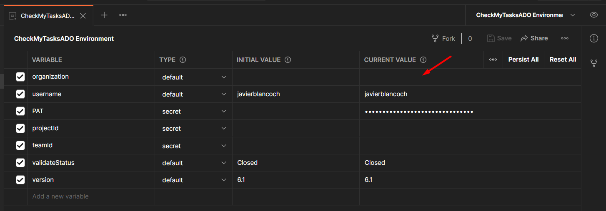
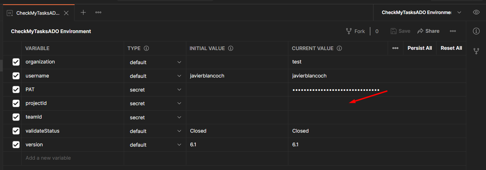
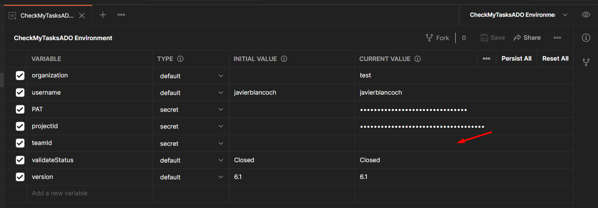
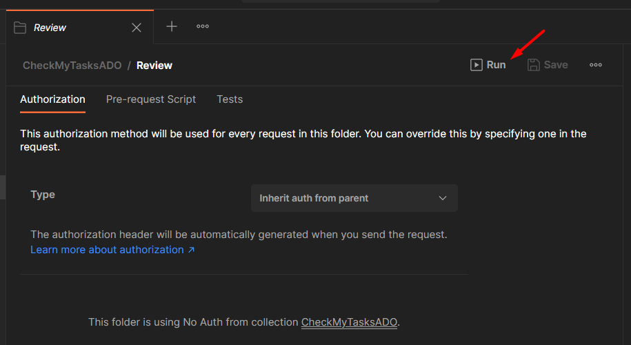
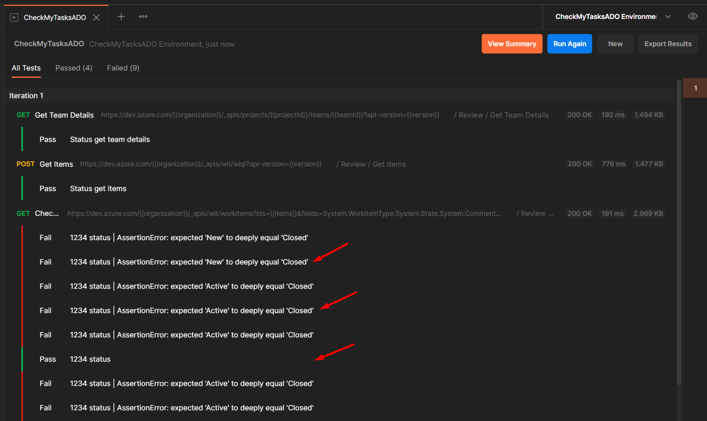

# CheckMyTasksADO-Please
Postman collection that checks if your tasks in Azure DevOps were closed.

Postman is a tool that allows us to test, consume and debug the REST API, a very interesting feature that it also has is that we can write automated tests, it is one of the most used tools for testing among other things.

We import the collection and the environment

# Process
- Get your personal access token
- Detail your organization
- Indicate the project of your preference
- Choose a team
- Check tasks!!!

# Get your personal access token
A personal access token (PAT) is used as an alternate password to authenticate in Azure DevOps, the collection needs the token to avoid authentication problems.

Fortunately, the process to obtain it is very well detailed in the following link
* https://docs.microsoft.com/en-us/azure/devops/organizations/accounts/use-personal-access-tokens-to-authenticate?view=azure-devops&tabs=preview-page

Note: When you create the token, you can specify some permissions, this could cause inconvenience, or you can choose "Full Access" for testing purposes only.

# Detail your organization
Now that we have our token, we must detail which is our organization, this can be found by visiting your Azure DevOps and you must place it in the following environment variable.

# Indicate the project of your preference
To be able to choose the project you want, you must execute "Get Projects" and review the answer, you may have many, once you see the project you want, you must copy its id and place it in the following environment variable.

# Choose a team
To be able to choose the team, you must execute "Get Project Teams" and review the answer, the teams that you will see will be from the project that you previously indicated, once you see the group you want, you must copy its id and place it in the following environment variable.

# Check tasks!!!
Finally now that we have completed the organization, the project and the team, it is time to start the review process.

We must click on "Review", choose the option "Run" and start the process.

And we will see the results.

With a couple of clicks we can know which tasks we have not closed, the process may be somewhat extensive, but we can still improve it.

Thank you very much!

## Credits
This project would not be possible without:
- https://www.postman.com/
- https://learning.postman.com/docs/sending-requests/managing-environments/
- https://learning.postman.com/docs/sending-requests/variables/
- https://azure.microsoft.com/es-es/services/devops/
- https://docs.microsoft.com/en-us/rest/api/azure/devops/?view=azure-devops-rest-6.1
- https://docs.microsoft.com/en-us/azure/devops/integrate/how-to/call-rest-api?view=azure-devops
